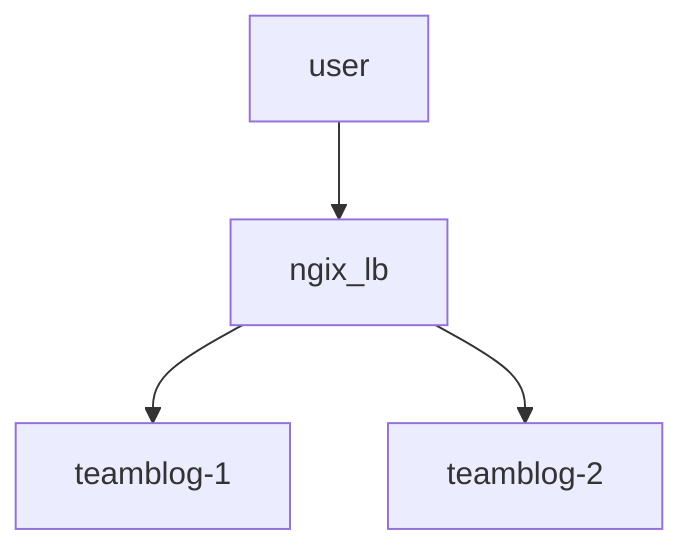

# 포트폴리오 사이트

## STG
|BRANCH|URL|
|---|:---|
|dev|https://aaingyunii.web.app|
|stg|https://aaingyunii.fly.dev|
|prd|https://aaingyunii.github.io|

<br>

## `Docker test` 환경 세팅 및 실행


### LOCAL docker build
- https://hub.docker.com/_/httpd

```bash
$ docker build -t my-apache2 .
$ sudo docker images
REPOSITORY   TAG       IMAGE ID       CREATED         SIZE
my-apache2   latest    e133bdde4db8   2 minutes ago   173MB
```

### LOCAL docker run
``` bash
$ sudo docker run -dit --name my-webapp -p 8080:80 my-apache2
$ sudo docker ps
CONTAINER ID   IMAGE        COMMAND              CREATED         STATUS         PORTS                                   NAMES
c52058cd5124   my-apache2   "httpd-foreground"   6 seconds ago   Up 5 seconds   0.0.0.0:8080->80/tcp, :::8080->80/tcp   my-webapp
```

### into docker
```bash
$ sudo docker exec -it my-webapp bash

root@c52058cd5124:/usr/local/apache2# ls -l

root@c52058cd5124:/usr/local/apache2# cd htdocs/

root@c52058cd5124:/usr/local/apache2/htdocs# ls -l

#파일 확인 후 http://localhost:8080 으로 웹 확인
```

### Deploy DEV
- https://aaingyunii.web.app
```bash
$ firebase deploy

=== Deploying to 'aaingyunii'...

i  deploying hosting
i  hosting[aaingyunii]: beginning deploy...
i  hosting[aaingyunii]: found 364 files in /
✔  hosting[aaingyunii]: file upload complete
i  hosting[aaingyunii]: finalizing version...
✔  hosting[aaingyunii]: version finalized
i  hosting[aaingyunii]: releasing new version...
✔  hosting[aaingyunii]: release complete

✔  Deploy complete!

Project Console: https://console.firebase.google.com/project/aaingyunii/overview
Hosting URL: https://aaingyunii.web.app
```

### Deploy ST
- https://aaingyunii.fly.dev/
```bash
# https://fly.io/docs/hands-on/install-flyctl/
$ curl -L https://fly.io/install.sh | sh
$ tail -n 3 ~/.zshrc 
# fly.io
export FLYCTL_INSTALL="/home/user1/.fly"
export PATH="$FLYCTL_INSTALL/bin:$PATH"

$ fly auth login

$ flyctl launch
Creating app in /home/user1/code/aaingyunii.github.io
Scanning source code
Detected a Dockerfile app
? Choose an app name (leave blank to generate one): aaingyunii                                                                                                                                                                            
automatically selected personal organization: data.mario24@gmail.com
Some regions require a paid plan (bom, fra, maa).
See https://fly.io/plans to set up a plan.

? Choose a region for deployment: Tokyo, Japan (nrt)
App will use 'nrt' region as primary

Created app 'aaingyunii' in organization 'personal'
Admin URL: https://fly.io/apps/aaingyunii
Hostname: aaingyunii.fly.dev
? Would you like to set up a Postgresql database now? No
? Would you like to set up an Upstash Redis database now? No
? Create .dockerignore from 1 .gitignore files? No
Wrote config file fly.toml
? Would you like to deploy now? No
Validating /home/user1/code/aaingyunii.github.io/fly.toml
Platform: machines
✓ Configuration is valid
Your app is ready! Deploy with `flyctl deploy`

$ tail -n 13  fly.toml
app = "aaingyunii"
primary_region = "nrt"

[build]
  dockerfile = "Dockerfile"

[http_service]
  internal_port = 80
  force_https = true
  auto_stop_machines = true
  auto_start_machines = true
  min_machines_running = 3
  processes = ["app"]

$ fly deploy
==> Verifying app config
Validating /home/user1/code/aaingyunii.github.io/fly.toml

...

Visit your newly deployed app at https://aaingyunii.fly.dev/
```

### how2pr
- https://oss.cashmallow.com/team/how2pr/

### Deploy PRD
- https://aaingyunii.github.io
- merge PR to main


### Register to Dockerhub

- https://hub.docker.com/r/aaingyunii/github.io/tags

```bash
$ docker login

$ docker build -t aaingyunii/aaingyunii.github.io .

$ docker push aaingyunii/aaingyunii.github.io

```

- result
- `$ docker pull aaingyunii/github.io:latest`


## `Load Balancer` - LB

### 팀원들의 블로그들을 등록하여 사이트 변환 확인



### `default.conf` 파일 생성 및 작성
```
upstream blog_servers {
        server hahyunkim-blog:80; # 팀원 블로그 도커 컨테이너
        server py-blog:80; # 팀원 블로그 도커 컨테이너
	server jaeho-blog:80; # 팀원 블로그 도커 컨테이너
}

server {
        listen 80;

    location / {
        proxy_pass http://blog_servers;
    }
}
```

### 도커 명령어 및 `LB` testing

```bash
# https://docs.docker.com/engine/reference/commandline/run/#options
$ docker build -t myblog .
$ git pull 팀원들의 dockerhub 주소(본인 블로그를 등록한 httpd 도커 이미지)
$ docker run -dit --name teamblog-1 -p 8051:80 teamblog1
$ docker run -dit --name teamblog-2 -p 8052:80 teamblog2

$ docker build -t nginx_lb docker_file/lb_nginx
$ docker images
REPOSITORY          TAG       IMAGE ID       CREATED          SIZE
myblog              1.3.0     b9a01b885bee   39 seconds ago   174MB
nginx_lb            1.3.0     a325da935d4f   3 minutes ago    187MB

$ docker run --name ngix_lb -d -p 9052:80 --link teamblog-1 --link teamblog-2 nginx_lb:1.3.0

$ docker ps
# 연결된 도커 컨테이너들이 활성화 중 인지 확인 후
# nginx-lb 주소로 여러 번 접속하여 사이트 변환 확인
```
